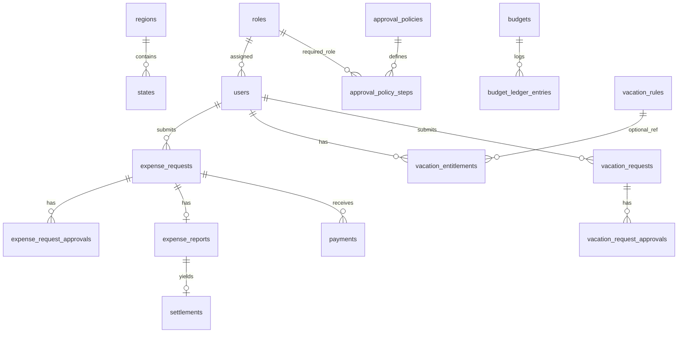

# Diccionario de datos — Etapa 2

**Versión:** 1.0  
**Referencia:** [functional-spec-stage1.md](functional-spec-stage1.md) (glosario §2, máquinas §3, eventos §4, TBD §5.2).

**Convenciones generales**

- Moneda operativa **MXN**; importes monetarios en **centavos** (`unsignedBigInteger` salvo donde se documente signo).
- Estados de negocio persistidos como `string` en **inglés `snake_case`** (§3). Validación estricta en aplicación (enums PHP) en etapa 3.
- Timestamps `created_at` / `updated_at` en todas las tablas de dominio salvo indicación contraria.
- **Sin** `spatie/laravel-permission` en esta etapa: catálogo `roles` + `users.role_id`. La decisión de mantener roles propios frente al PLAN está en [roles-architecture-decision.md](roles-architecture-decision.md).

---

## Orden sugerido de migraciones

1. `regions`, `states`, `roles`, alter `users`  
2. `approval_policies`, `approval_policy_steps`  
3. `expense_requests`, `expense_request_approvals`, `payments`, `expense_reports`, `settlements`  
4. `budgets`, `budget_ledger_entries`  
5. `vacation_rules`, `vacation_entitlements`, `vacation_requests`, `vacation_request_approvals`  
6. `attachments`, `document_events`

---

## Diagrama ER (resumen)

---

## Catálogo y usuario

### `regions`

| Columna | Tipo | Null | Índices / FK | Notas |
|---------|------|------|--------------|-------|
| `id` | bigint PK | no | | |
| `code` | string(32) | no | unique | Código estable (ej. región interna). |
| `name` | string(255) | no | | Nombre para UI. |
| `created_at`, `updated_at` | timestamp | | | |

**Spec:** §1.2 territorio.

### `states`

Entidad federativa (no confundir con “estatus” de documento).

| Columna | Tipo | Null | Índices / FK | Notas |
|---------|------|------|--------------|-------|
| `id` | bigint PK | no | | |
| `region_id` | bigint FK → regions | no | index | |
| `code` | string(16) | no | unique | Ej. clave INEGI abreviada o interna. |
| `name` | string(255) | no | | |
| `created_at`, `updated_at` | timestamp | | | |

**Spec:** §1.2.

### `roles`

Rol organizacional / aplicación (hasta integrar permisos finos en etapa 3).

| Columna | Tipo | Null | Índices / FK | Notas |
|---------|------|------|--------------|-------|
| `id` | bigint PK | no | | |
| `slug` | string(64) | no | unique | Valores §1.3: `super_admin`, `secretario_general`, `contabilidad`, `coord_regional`, `coord_estatal`, `asesor`. |
| `name` | string(255) | no | | Etiqueta negocio. |
| `created_at`, `updated_at` | timestamp | | | |

**Spec:** §1.3, glosario `role`.

### `users` (columnas añadidas)

| Columna | Tipo | Null | Índices / FK | Notas |
|---------|------|------|--------------|-------|
| `username` | string(64) | sí | unique | Único cuando presente; **TBD** obligatoriedad en registro. |
| `phone` | string(32) | sí | | |
| `region_id` | bigint FK | sí | index | |
| `state_id` | bigint FK | sí | index | |
| `role_id` | bigint FK → roles | sí | index | Un rol organizacional principal por usuario (spec §1.2 singular). |

**Spec:** §1.2.

---

## Políticas de aprobación (estructura)

### `approval_policies`

Conjunto versionable de reglas por tipo de documento (y opcionalmente por rol solicitante).

| Columna | Tipo | Null | Índices / FK | Notas |
|---------|------|------|--------------|-------|
| `id` | bigint PK | no | | |
| `document_type` | string(64) | no | index | Ej. `expense_request`, `vacation_request`. |
| `name` | string(255) | no | | Etiqueta humana. |
| `version` | unsignedInteger | no | default 1 | Incremental por tipo. |
| `requester_role_id` | bigint FK → roles | sí | index | Si null, política “por defecto” para ese `document_type`. |
| `effective_from` | date | sí | | Vigencia opcional. |
| `effective_to` | date | sí | | |
| `is_active` | boolean | no | default true | Solo una activa por contexto resuelve el motor (etapa 4). |
| `created_at`, `updated_at` | timestamp | | | |

**Spec:** glosario `approval_policy` §2.

### `approval_policy_steps`

| Columna | Tipo | Null | Índices / FK | Notas |
|---------|------|------|--------------|-------|
| `id` | bigint PK | no | | |
| `approval_policy_id` | bigint FK | no | index, unique (`approval_policy_id`, `step_order`) | |
| `step_order` | unsignedSmallInteger | no | | 1-based. |
| `role_id` | bigint FK → roles | no | | Rol requerido en el paso. |
| `combine_with_next` | string(8) | no | default `and` | `and` \| `or` — semántica entre este paso y el siguiente (**TBD** refinamiento UI). |
| `created_at`, `updated_at` | timestamp | | | |

**Spec:** glosario `approval_policy_step` §2.

---

## Ciclo de gastos

### `expense_requests`

| Columna | Tipo | Null | Índices / FK | Notas |
|---------|------|------|--------------|-------|
| `id` | bigint PK | no | | |
| `user_id` | bigint FK → users | no | index | Solicitante. |
| `status` | string(64) | no | index | Estados §3.1. |
| `folio` | string(64) | sí | unique | Formato **TBD** (§5.2 TBD-5). |
| `requested_amount_cents` | unsignedBigInteger | no | | |
| `approved_amount_cents` | unsignedBigInteger | sí | | Monto tras cadena de aprobación si difiere del solicitado. |
| `concept` | text | no | | |
| `delivery_method` | string(32) | no | | `cash`, `transfer` (extensible). |
| `created_at`, `updated_at` | timestamp | | | |
| `deleted_at` | timestamp | sí | | Soft delete opcional deshabilitado en spec; **no** añadido — cancelación explícita vía estado + `document_events`. |

**Estados válidos (persistidos):** `submitted`, `approval_in_progress`, `rejected`, `cancelled`, `approved`, `pending_payment`, `paid`, `awaiting_expense_report`, `expense_report_in_review`, `expense_report_rejected`, `expense_report_approved`, `settlement_pending`, `closed`.

**Spec:** §3.1.

### `expense_request_approvals`

Instancias generadas por el motor (etapa 4).

| Columna | Tipo | Null | Índices / FK | Notas |
|---------|------|------|--------------|-------|
| `id` | bigint PK | no | | |
| `expense_request_id` | bigint FK | no | index | cascade delete con solicitud (o restrict según política de retención — aquí **cascade**). |
| `step_order` | unsignedSmallInteger | no | | Copia del orden en política al generar. |
| `role_id` | bigint FK → roles | no | | Rol requerido. |
| `status` | string(32) | no | index | `pending`, `approved`, `rejected`, `skipped` (**TBD** si aplica skipped). |
| `approver_user_id` | bigint FK → users | sí | | Quién actuó. |
| `note` | text | sí | | Obligatoria al rechazar (validación en app). |
| `acted_at` | timestamp | sí | | |
| `created_at`, `updated_at` | timestamp | | | |

**Spec:** glosario `expense_request_approval` §2.

### `payments`

Registro de pago por contabilidad; evidencia en `attachments` (morph).

| Columna | Tipo | Null | Índices / FK | Notas |
|---------|------|------|--------------|-------|
| `id` | bigint PK | no | | |
| `expense_request_id` | bigint FK | no | index | |
| `recorded_by_user_id` | bigint FK → users | no | | Usuario contabilidad. |
| `amount_cents` | unsignedBigInteger | no | | Debe alinearse con reglas de negocio vs monto aprobado. |
| `payment_method` | string(32) | no | | `cash`, `transfer`, etc. |
| `paid_on` | date | no | | |
| `transfer_reference` | string(255) | sí | | Si aplica. |
| `created_at`, `updated_at` | timestamp | | | |

**Spec:** transición `pending_payment` → `paid` §3.1, evento E6 §4.1.

### `expense_reports`

Relación **1:1** con `expense_requests` (`expense_request_id` unique).

| Columna | Tipo | Null | Índices / FK | Notas |
|---------|------|------|--------------|-------|
| `id` | bigint PK | no | | |
| `expense_request_id` | bigint FK | no | unique | |
| `status` | string(64) | no | index | §3.2: `draft`, `submitted`, `accounting_review`, `rejected`, `approved`, `cancelled`. |
| `reported_amount_cents` | unsignedBigInteger | no | | |
| `submitted_at` | timestamp | sí | | |
| `created_at`, `updated_at` | timestamp | | | |

**Spec:** §3.2; versionado físico de archivos **TBD** (TBD-7) — evidencias vía `attachments`.

### `settlements`

Generado al aprobar comprobación; **FK canónica:** `expense_report_id` (1:1).

| Columna | Tipo | Null | Índices / FK | Notas |
|---------|------|------|--------------|-------|
| `id` | bigint PK | no | | |
| `expense_report_id` | bigint FK | no | unique | |
| `status` | string(64) | no | index | §3.3: `calculated`, `pending_user_return`, `pending_company_payment`, `settled`, `closed`. |
| `basis_amount_cents` | unsignedBigInteger | no | | Base del cuadre; **por defecto documentado:** monto **pagado** (TBD-8). |
| `reported_amount_cents` | unsignedBigInteger | no | | Copia al calcular. |
| `difference_cents` | bigInteger | no | | `basis_amount_cents - reported_amount_cents` (convención fija etapa 3+; ajustar si negocio define otra). |
| `created_at`, `updated_at` | timestamp | | | |

**Spec:** §3.3. Dirección del flujo se deriva del signo de `difference_cents` (§3.3 tabla).

---

## Presupuesto y ledger

### `budgets`

| Columna | Tipo | Null | Índices / FK | Notas |
|---------|------|------|--------------|-------|
| `id` | bigint PK | no | | |
| `budgetable_type` | string(255) | no | | Morph: `Region`, `State`, `User`, `Role`. |
| `budgetable_id` | bigint | no | | |
| `period_starts_on` | date | no | | |
| `period_ends_on` | date | no | | |
| `amount_limit_cents` | unsignedBigInteger | no | | Cupo del periodo. |
| `priority` | unsignedSmallInteger | sí | | Mayor = más específico si hay solape (§1.4); resolución **TBD** si solo basta regla de tipo. |
| `created_at`, `updated_at` | timestamp | | | |
| Índice compuesto | | | (`budgetable_type`, `budgetable_id`, `period_starts_on`, `period_ends_on`) | Para consultas por scope y fechas. |

**Spec:** glosario `budget` §2, §1.4.

### `budget_ledger_entries`

Registro **inmutable** (no se actualiza; reversos vía nuevas filas tipo `reverse`).

| Columna | Tipo | Null | Índices / FK | Notas |
|---------|------|------|--------------|-------|
| `id` | bigint PK | no | | |
| `budget_id` | bigint FK | no | index | |
| `entry_type` | string(32) | no | index | `commit`, `spend`, `reverse`, `adjust`. |
| `amount_cents` | unsignedBigInteger | no | | Magnitud siempre positiva; semántica según `entry_type`. |
| `source_type` | string(255) | no | | Morph (ej. `ExpenseRequest`, `Payment`). |
| `source_id` | bigint | no | | |
| `reverses_ledger_entry_id` | bigint FK → self | sí | | Enlace opcional para trazabilidad de reverso. |
| `created_at`, `updated_at` | timestamp | | | |

**Spec:** glosario `budget_ledger_entry` §2, §1.4 descuento en dos fases.

---

## Vacaciones

### `vacation_rules`

Tabla configurable de antigüedad / límites (estructura mínima etapa 2).

| Columna | Tipo | Null | Índices / FK | Notas |
|---------|------|------|--------------|-------|
| `id` | bigint PK | no | | |
| `code` | string(64) | no | unique | |
| `name` | string(255) | no | | |
| `min_years_service` | unsignedDecimal(4,1) | no | default 0 | Inclusive. |
| `max_years_service` | unsignedDecimal(4,1) | sí | | Null = sin techo. |
| `days_granted_per_year` | unsignedSmallInteger | no | | Días de derecho anual según tramo. |
| `max_days_per_request` | unsignedSmallInteger | sí | | **TBD** reglas §3.4. |
| `max_days_per_month` | unsignedSmallInteger | sí | | |
| `max_days_per_quarter` | unsignedSmallInteger | sí | | |
| `max_days_per_year` | unsignedSmallInteger | sí | | |
| `blackout_dates` | json | sí | | Periodos no solicitables. |
| `sort_order` | unsignedSmallInteger | no | default 0 | Evaluación de tramos. |
| `created_at`, `updated_at` | timestamp | | | |

**Spec:** §3.4 validaciones previas a `submitted`.

### `vacation_entitlements`

Días por usuario y año civil (materializado; puede reconciliarse con reglas + solicitudes en jobs).

| Columna | Tipo | Null | Índices / FK | Notas |
|---------|------|------|--------------|-------|
| `id` | bigint PK | no | | |
| `user_id` | bigint FK | no | | |
| `calendar_year` | unsignedSmallInteger | no | | |
| `days_allocated` | unsignedSmallInteger | no | | |
| `days_used` | unsignedSmallInteger | no | default 0 | |
| `vacation_rule_id` | bigint FK | sí | | Regla aplicada al calcular asignación (opcional). |
| `created_at`, `updated_at` | timestamp | | | |
| Unique | | | (`user_id`, `calendar_year`) | |

**Spec:** §3.4 `vacation_entitlements`.

### `vacation_requests`

| Columna | Tipo | Null | Índices / FK | Notas |
|---------|------|------|--------------|-------|
| `id` | bigint PK | no | | |
| `user_id` | bigint FK | no | index | |
| `status` | string(64) | no | index | §3.4: `draft`, `submitted`, `approval_in_progress`, `rejected`, `cancelled`, `approved`, `completed`. |
| `folio` | string(64) | sí | unique | **TBD** formato. |
| `starts_on` | date | no | | |
| `ends_on` | date | no | | |
| `business_days_count` | unsignedSmallInteger | no | | Calculado en app al enviar. |
| `created_at`, `updated_at` | timestamp | | | |

**Spec:** §3.4.

### `vacation_request_approvals`

Análogo a `expense_request_approvals`.

| Columna | Tipo | Null | Índices / FK | Notas |
|---------|------|------|--------------|-------|
| `id` | bigint PK | no | | |
| `vacation_request_id` | bigint FK | no | index | cascade. |
| `step_order` | unsignedSmallInteger | no | | |
| `role_id` | bigint FK | no | | |
| `status` | string(32) | no | index | |
| `approver_user_id` | bigint FK | sí | | |
| `note` | text | sí | | Obligatoria en rechazo. |
| `acted_at` | timestamp | sí | | |
| `created_at`, `updated_at` | timestamp | | | |

---

## Adjuntos y eventos de documento

### `attachments`

Evidencias (PDF, imagen, XML) asociadas polimórficamente a pagos, comprobaciones, settlements, etc.

| Columna | Tipo | Null | Índices / FK | Notas |
|---------|------|------|--------------|-------|
| `id` | bigint PK | no | | |
| `attachable_type` | string(255) | no | | |
| `attachable_id` | bigint | no | | |
| `uploaded_by_user_id` | bigint FK → users | no | | |
| `disk` | string(32) | no | default `local` | |
| `path` | string(1024) | no | | Ruta relativa al disk. |
| `original_filename` | string(512) | no | | |
| `mime_type` | string(255) | sí | | |
| `size_bytes` | unsignedBigInteger | no | | |
| `created_at`, `updated_at` | timestamp | | | |
| Índice | | | (`attachable_type`, `attachable_id`) | |

**Spec:** §1.1 evidencias, glosario `evidence` §2.

### `document_events`

Rechazos y cancelaciones con **nota obligatoria** (validación en app); extensible a otros eventos de auditoría.

| Columna | Tipo | Null | Índices / FK | Notas |
|---------|------|------|--------------|-------|
| `id` | bigint PK | no | | |
| `subject_type` | string(255) | no | | Morph: `ExpenseRequest`, `ExpenseReport`, `VacationRequest`, etc. |
| `subject_id` | bigint | no | | |
| `event_type` | string(32) | no | index | Valores en `App\Enums\DocumentEventType` (p. ej. `expense_request_submitted`, `expense_request_chain_approved`, `rejection`, …) |
| `actor_user_id` | bigint FK → users | no | | |
| `note` | text | no | | Obligatorio para tipos anteriores. |
| `metadata` | json | sí | | Contexto adicional. |
| `created_at`, `updated_at` | timestamp | | | |
| Índice | | | (`subject_type`, `subject_id`) | |

**Spec:** glosario `rejection`, `cancellation` §2; TBD-4 actores de cancelación quedan en reglas de app.

---

## TBD de etapa 1 — registro en modelo de datos

| ID | Tratamiento en etapa 2 |
|----|-------------------------|
| TBD-1 | Flujo usuario: transición atómica `submitted` → `approval_in_progress` en app; ambos estados persistidos. |
| TBD-2 | Ambos estados `approved` y `pending_payment` en columna `status`; motor puede colapsar transición. |
| TBD-3 | Sin columna SLA; job/config etapa posterior. |
| TBD-4 | Sin columnas extra; `document_events` + políticas etapa 3. |
| TBD-5 | `folio` nullable hasta formato y secuencia. |
| TBD-6 | Sin columna; política XML opcional en configuración futura o `approval_policies` extendido. |
| TBD-7 | Sin `expense_report_versions`; solo `attachments` + eventos. |
| TBD-8 | `settlements.basis_amount_cents` = monto pagado por defecto (documentado arriba). |
| TBD-9 | Sin tabla `system_receipts` en esta etapa. |
| TBD-10 | Sin rol RRHH; notificaciones posteriores. |
| TBD-11 | Columna `completed` en `vacation_requests.status` disponible; uso opcional. |

---

## Criterio de salida etapa 2

- Diccionario alineado con §2–§4 de la spec funcional.  
- Migraciones ejecutables en base limpia.  
- Prueba automatizada mínima de existencia de tablas/columnas críticas.
